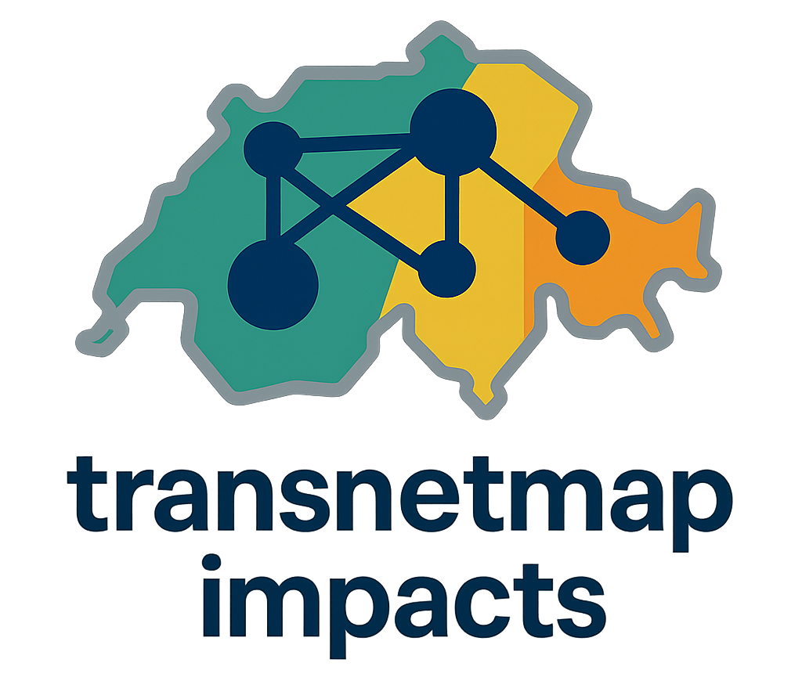

# transnetmap-impacts


<p align="center">
  <picture>
    <source media="(prefers-color-scheme: dark)" srcset="docs/assets/logo-dark.png">
    <source media="(prefers-color-scheme: light)" srcset="docs/assets/logo-light.png">
    
  </picture>
</p>


<!-- docs:start -->

[](https://transnetmap-impacts.readthedocs.io/en/stable/)
[](https://transnetmap-impacts.readthedocs.io/en/latest/)
[](https://github.com/valentinpasche/transnetmap-impacts/releases)

[](LICENSE)


**A Python package for macro-scale analysis of new transport networks vs existing ones with impacts choropleth maps.**

- GitHub repo: <https://github.com/valentinpasche/transnetmap-impacts>
- Documentation: <https://transnetmap-impacts.readthedocs.io>
- Free software: [MIT license](https://opensource.org/licenses/MIT)

## Introduction

**Macro-scale transport network impacts and mapping.**  
This package provides a fast, qualitative workflow to compare a **new transport network** against the **current system**, at **macro** level: travel-time deltas and **environmental/techno-economic impacts** (e.g. `CO2`, `EP`, `TCO`).  
Results are visualized as **choropleth maps** for quick interpretation by engineers, analysts, and decision-makers.

**Optimization is time-based.** Shortest paths minimize **travel time only** (fixed metric = `'time'`). This choice matches the **macro-scale** scope: time is the most comparable, stable, and decision-relevant accessibility metric across modes and regions.  
Environmental/techno-economic impacts (e.g. `CO2`, `EP`, `TCO`) are then **computed along these time-optimal routes**; they are **not** used as optimization criteria.

> **Note**  
> Import name is **`transnetmap`**. The package is designed around a PostgreSQL database with the **PostGIS** extension enabled. A Switzerland case study is used in the docs, but the workflow generalizes to other regions.

---

## Installation (stable)

Installing this package requires a Conda virtual environment to manage dependencies in isolation.  
It is not distributed on public channels such as **PyPI** (pip) or **Conda-Forge**.  

The stable environment installs the package from a **GitHub tag ZIP**,  
and all its dependencies from conda-forge.

```bash
# Creates the environment from the configuration file
conda env create -f environment.yml

# Activates the newly created environment
conda activate transnetmap

# Installation verification
python -c "import transnetmap as tnm; print('OK:', tnm.__name__)"
```

**Requirements**

- Python 3.12
- PostgreSQL with **PostGIS** enabled (not included)
- See `environment.yml` for the full dependency list (e.g. `networkx`, `geopandas`, `polars`, `folium`, `pyarrow`, ADBC drivers for Polars).

---

## Documentation

The complete user guide (workflow overview, Western Switzerland quickstart, API reference via `mkdocstrings`) will be published on **Read the Docs**:

**Read the Docs:** <https://transnetmap-impacts.readthedocs.io/en/stable/>  
For the latest docs, see: <https://transnetmap-impacts.readthedocs.io/en/latest/>

Planned structure (mirrors the style of well-known scientific Python projects):

- **Overview** – purpose, scope, key concepts
- **Get Started** – 5-step pipeline (load datasets, configure settings, build new network, run Dijkstra, generate map)
- **Full workflow (PostGIS)** – schema, example queries, configuration (`HeatMapConfig`), reproducible outputs
- **Examples** – notebooks (viewable via nbviewer), exported HTML maps
- **API Reference** – generated from docstrings (NumPy style)

---

## Project & context

This work was developed at HES-SO, *University of Applied Sciences and Arts of Western Switzerland*, within the **GRIPIT** project (Axis 1), with a focus on **macro-scale** assessment and **visual communication** of network impacts to facilitate early-stage decision-making. This approach has been presented at **Maglev24**.  
While the documentation illustrates the workflow on a **Switzerland** case study, the model is **generalizable** to other regions provided similar data are available (network, OD matrices, reference impact factors).  
[Link to GRIPIT project page @HES-SO](https://www.hes-so.ch/recherche-innovation/projets-de-recherche/detail-projet/gripit-groupe-de-recherche-interdisciplinaire-en-projet-innovant-de-transport)

---

## Authors & Contributors

**Author (Lead & Maintainer)**
- **Valentin Pasche** — HEIA-FR (HES-SO)  
  *Roles:* Conceptualization, Software (lead), Methodology, Validation, Writing – original draft  

**Contributors (GRIPIT – Axis 1)**
- **Dr. Vincent Bourquin** — HEIA-FR (HES-SO)  
  *Roles:* Project administration, Supervision, Methodology  
- **Florian Davoine** — HEIA-FR (HES-SO)  
  *Roles:* Methodology, Software, Validation  

---

## Support

Found a bug, or have a feature request, raise an issue on the
GitHub [issue tracker](https://github.com/valentinpasche/transnetmap-impacts/issues).
Alternatively you can get support on the
[discussions](https://github.com/valentinpasche/transnetmap-impacts/discussions) page.

---

## Disclaimer

- The model operates at a **macro** level to provide **qualitative** and **order-of-magnitude** assessments; it is **not** a micro-simulation tool, nor a replacement for detailed engineering studies.  
- **No warranty on accuracy or completeness** of results is provided. Outputs depend on input data quality, simplifying assumptions, and configuration choices.  
- Proper interpretation requires domain expertise and awareness of data limitations (e.g., sources, spatial coverage, temporal representativeness).  
- Use the results as **decision support** for exploration and screening; do not rely on them for detailed design, operational planning, or financial commitments without further analysis.


<!-- docs:end -->

---

## License

This project is licensed under the **MIT License**. See the [LICENSE](LICENSE) file for details.

